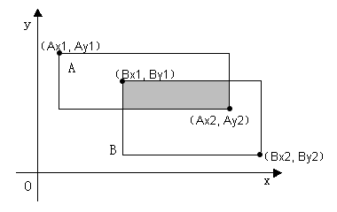

1.	计算公式：求π的值b
【问题描述】

给定一个精度值e，用下列公式计算π的近似值，要求前后两次π的迭代之差的绝对值小于e，给出相应的最小迭代次数n和最后一次计算的π的值。
π/2=1+1!/3+2!/(3×5)+3!/(3×5×7)+…+(n-1)!/(3×5×7×…×(2n-1))

【输入形式】

从控制台输入e( e>=0.000001 )的值。

【输出形式】

输出迭代次数n和最后一次计算的π的值（以一个空格分隔，并且输出π时要求小数点后保留7位有效数字）。

【样例输入】

0.000003

【样例输出】

19 3.1415912

【样例说明】

输入的精度e为0.000003，当n为17时，计算的π值为3.1415864，n为18时计算的π值为3.1415896，两者之差为0.0000032，大于给定的精度值，所以需要继续计算。当n为19时，计算的π值为3.1415912，与上次之差为0.0000016，小于给定的精度值，所以最小迭代次数为19，输出的π值为3.1415912。

注意：
(1) 为保证计算精度，请使用double数据类型保存计算数据。
(2) 应至少迭代两次，即：n>=2。

【评分标准】

该题要求输出最小迭代次数和π的值，共有5个测试点。上传C语言文件名为example1a.c。

2.	合数分解
【问题描述】

由数学基本定理可知：任何一个大于1的非素数整数（即合数）都可以唯一分解成若干个素数的乘积。编写程序，从控制台读入一个合数（合数的大小不会超过int数据类型表示的范围），求这个合数可以分解成的素数。

【输入形式】

从控制台输入一个合数。

【输出形式】

在标准输出上按照由小到大的顺序输出分解成的素数，各素数之间以一个空格分隔，最后一个整数后也可以有一个空格。

【输入样例】

12308760

【输出样例】

2 2 2 3 3 3 3 5 29 131

【样例说明】

输入的合数为12308760，其分解成的素数乘积为：2*2*2*3*3*3*3*5*29*131。

【评分标准】

该题要求输出合数分解成的素数，共有5个测试点，提交程序文件名为primes.c。

3.	矩形相交
【问题描述】

平面上有两个矩形A和B，其位置是任意的。编程求出其相交部分（如图中阴影部分）的面积。（0<=a，b<=1000）

【输入形式】

从标准输入读取两行以空格分隔的整数，格式如下：

Ax1 Ay1 Ax2 Ay2
Bx1 By1 Bx2 By2

其中（x1，y1）和（x2，y2）为矩形对角线上端点的坐标。各坐标值均为整数，取值在0至1000之间。

【输出形式】

向标准输出打印一个整数，是两矩形相交部分的面积（可能为0）。

【输入样例】

0 0 2 2
1 1 3 4

【输出样例】

1

提示：输入的两点可以是矩形任一对角线上的端点，求相交的面积可以先求矩形在X轴和Y轴上的交集。矩形在X轴上的交集可以按照如下算法进行求解：假设AX1和AX2中的较大值为MAX_AX，较小值为MIN_AX；BX1和BX2中的较大值为MAX_BX，较小值为MIN_BX。用MAX_AX和MAX_BX中的较小者减去MIN_AX和MIN_BX中的较大者，结果为正表示两矩形在X轴上的交集，若为负则表示不相交。

【评分标准】

结果完全正确得20分，每个测试点4分，提交程序文件名为area.c。

4.	连续正整数的和
【问题描述】

对于一个正整数x（3≤x≤1000），寻找一种方案，将x分解成连续正整数的和。即
x=x1+x2+……+xn
其中x1、x2、……、xn是自小至大的连续正整数，且n>1。
比如，对于输入的数字10，可以分解成“10=1+2+3+4”。
如果存在多于一种的可行方案，则选取等式右边项的个数最多的那一种。比如，9可以分解为“9=2+3+4”，也可以分解为“9=4+5”。但是前一种分解成3个数的和，后一种分解成2个数的和，所以前一种是有效解。如果无法分解，则输出No Answer。
【样例输入1】
38 
【样例输出1】
38=8+9+10+11 
【样例输入2】

256 
【样例输出2】

No Answer 

【评分标准】
结果完全正确得20分，每个测试点4分，提交程序文件名为c0304.c。

5.	判断可逆素数
【问题描述】若将某一素数的各位数字的顺序颠倒后得到的数仍是素数，则此素数称为可逆素数。编写一个判断某数是否可逆素数的函数，在主函数中输入一个整数，再调用此函数进行判断
【输入形式】用户在第一行输入一个整数。
【输出形式】程序在下一行输出yes或是no,yes表示此数是可逆素数，no表示不是。用户输入的数必须为正整数。注意：yes或是no全是小写输出。
【样例输入】23
【样例输出】no
【样例说明】用户输入23，23各位数字颠倒之后得到32，23是素数，但32不是素数，所以23不是可逆素数。
【评分标准】结果完全正确得20分，每个测试点4分。提交程序名为：getprimenum.c

6.	求差集
【问题描述】两个集合的差集定义如下：
集合A、B的差集，由所有属于A但不属于B的元素构成。
输入两个集合A、B，每个集合中元素都是自然数。求集合A、B的差集。
【输入形式】
从标准输入接收集合中的自然数元素，以空格分隔。-1表示输入结束。
其中，每个集合都不输入重复的元素。
【输出形式】
输出差运算后集合中的元素，以空格分隔。输出元素的顺序与原有集合A输入的顺序一致。
如果A、B的差集为空集，则不输出任何数值。
【样例输入】
2 8 3 4 -1
6 1 4 9 -1
【样例输出】
2 8 3
【样例说明】从标准输入接收集合中的自然数元素，输出集合A、B的差集。
【评分标准】该题要求输出差运算后集合中的元素，结果完全正确得20分，每个测试点4分。上传C语言文件名为sets.c。