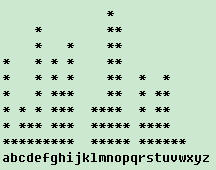

1.	删数问题
【问题描述】输入一个高精度的大正整数S（S最长可达240位），去掉其中任意N位数字后剩下的数字按原次序组成一个新的正整数S&rsquo;。编程对给定的N和S，寻找一种方案使得剩下的数字组成的新数S&rsquo;最小。
【输入形式】输入有两行：
1.第一行是大整数S。其中S最长可达240位。
2.第二行是整数N。S、N均以非0数字开头。
【输出形式】输出有一行，是在S中删除N位后所得的最小数字S&rsquo;。
【样例输入1】
178543
4
【样例输出1】13

【样例输入2】
1002
1
【样例输出2】002

【样例说明】样例1中输入整数S=178543，N=4，要求在178543中删除4位，使剩下的数字最小。正确答案为S&rsquo; = 13。样例2中输入整数S＝1002，N＝1，删完一位后S&rsquo; = 002，而不是2，即2之前的0也必须输出。
【运行时限】程序一次运行的最长时间限制在15秒内，超出则认为程序错误。

【算法提示】将整数看作字符串形式读入；删数时，从前往后寻找第一个比后一个数字大的数字，然后删除之，按照这种方法删除N个数字即得最小数字。

【评分标准】该题要求输出一个大整数的各位数字。结果完全正确得20分，每个测试点4分。上传C语言文件名为delete.c。

2.	扩展字符
【问题描述】
编写一函数expand(s1,s2)，用以将字符串s1中的缩记符号在字符串s2中扩展为等价的完整字符，例如将a-d扩展为abcd。该函数可以处理大小写字母和数字，并可以处理a-b-c、a-z0-9与-a-z等类似的情况。在main函数中测试该函数：从键盘输入包含缩记符号的字符串，然后调用该函数进行扩展，输出扩展结果。
（教材 P63：Exercise 3-3）

注意：

待扩展字符串中有可能包含空格，例如：a-d x-z应扩展成：abcd xyz。所以读入待扩展字符串时，应能够读入包含空格的字符串。
只要缩记符号-之后的字符比之前的字符的ASCII码值大，就要将它们之间的所有字符扩展出来，例如：Z-a之间的字符也要扩展出来；
特殊情况：a-b-c将被扩展为：abc。a-a将被扩展为：a-a。
   【输入形式】
从键盘输入包含扩展符的字符串
【输出形式】
输出扩展后的字符串
【输入样例】
a-c-u-B
【输出样例】
abcdefghijklmnopqrstu-B
【样例说明】
扩展输入a-c-u为：abcdefghijklmnopqrstu，而B比u值小，所以无法扩展，直接输出。
【评分标准】
结果完全正确得20分，每个测试点4分，提交程序文件expand.c。

3.	字母频率统计
【问题描述】

编写程序从标准输入中读入一段英文，统计其中小写字母出现次数，并以柱状图的形式显示其出现次数。

【输入形式】

在标准输入上输入一段英文文章（可能有一行，也可能有多行），在新的一行的开头输入ctrl+z键表示结束。

【输出形式】

在屏幕上依次输出表示每个小写字母出现次数的柱状图（以“*”字符表示柱状图，空白处用空格字符表示，某个小写字母出现多少次，就显示多少“*”字符；柱状图的高度以出现最多的字母次数为准），在最后一行依次输出26个小写字母。

【样例输入】

The computing world has undergone a
revolution since the publication of
The C Programming Language in 1978.

【样例输出】

【样例说明】

在输入的英文短文中，小写字母a出现了6次，所以其上输出了6个字符"*"。出现次数最多的是字母n，所以柱状图的高度为9个字符。字母j没有出现，所以其上都为空格字符。

【评分标准】

该题要求输出柱状图表示的字母出现次数，共有5个测试点。上传C语言文件名为bar.c。

4.	文件拷贝2
【问题描述】
写一程序将一个文件fcopy.in拷贝至另一个文件fcopy.out, 其中在所拷贝的文件中, 多个连续空白符（包括空格符、制表符）只拷贝一个空格符， 其它字符不变。
【输入形式】
源文件名和目标文件名分别为fcopy.in和fcopy.out，程序将从当前目录下读取fcopy.in文件。
【输出形式】
将fcopy.in文件内容拷贝至当前目录下的fcopy.out文件中。在所拷贝的文件中, 多个连续空白符（包括空格符、制表符）只拷贝一个空格符，若非空白符之间有一个制表符，则该制表符也要替换为空格符，其它字符不变。
【输入样例】
假如文件fcopy.in中内容如下：
Alcatel        provides end-to-end solutions.
【输出样例】
输出文件fcopy.out中内容为：
Alcatel provides end-to-end solutions.
【样例说明】
将文件fcopy.in拷贝到fcopy.out，同时做适当的转换。
【评分标准】
其中在所拷贝的文件中, 多个连续空白符（包括空格符、制表符）只拷贝一个空格符，其它字符不变，完全符合要求得20分，每个测试点4分。提交程序名为copy.c。

5.	注释比例
【问题描述】

一个好的程序要有一定比例的注释。编写一个程序统计一个C源文件中注释所占的百分比。百分比计算公式为：程序注释中字符总数（/*和*/除外的所有字符）除以程序文件中总字符数（程序文件中的所有字符）。
注：只简单考虑/*…*/的注释，而且要考虑注释跨行的情况，不要考虑其它复杂情况。

【输入形式】

从当前目录下的filein.c源程序文件获得输入。

【输出形式】

向控制台输出注释所占百分比，百分数无小数（小数部分直接截掉，不要四舍五入），后跟百分号%。

【样例输入】

假设filein.c的内容为：

void main()
{
	FILE * in;
	/*Open the file*/
	if((in=fopen("in.txt","r"))==NULL)
	{
		printf("Can’t open in.txt!");
		return;
	}
	/*Close the file,
	and return.*/
	fclose(in);
}

【样例输出】

22%

【样例说明】

filein.c文件的总字符数为179，注释中的字符数为41，则注释所占百分比为22%。

【评分标准】

该题要求输出注释所占百分比，共有5个测试点。上传C语言文件名为comment.c。

6.	矩阵运算
【问题描述】
对于多个N阶矩阵，依次进行加、减运算。

【输入形式】
从标准输入读取输入。第一行只有一个整数N（1≤N≤10），代表矩阵的阶数。
接下来是一个矩阵，是N行，每行有N个整数（可能是正、负整数），是矩阵的所有元素。
然后一行只含一个字符“+”或“-”，代表加、减操作。
然后用同样的方式输入另一个矩阵。
后续仍然是运算符和矩阵。直至运算符为“#”时停止计算，将结果输出。

【输出形式】
向标准输出打印矩阵的操作结果。输出N行，每行对应矩阵在该行上的所有元素，每一行末均输出一个回车符。每个元素占5个字符宽度（包括负号），向右对齐，不足部分补以空格。
【输入样例】
3
1 -2 7
2 8 -5
3 6 9
+
3 5 7
-1 2 6
3 7 10
-
1 -2 7
2 8 -5
3 6 9
#

【输出样例】
（下图中”-”代表空格）
####3####5####7
###-1####2####6
####3####7###10
【评分标准】
本题不准使用数学库函数。运行时限1秒，完全正确20分，每个测试点4分。提交程序文件名为matrix.c。

7.	表达式计算（支持空格，连乘，连除）（选做题，不计分）
【问题描述】

从标准输入中读入一个整数算术运算表达式，如5 - 1 * 2 * 3 + 12 / 2 / 2  = 。计算表达式结果，并输出。

要求：
1、表达式运算符只有+、-、*、/，表达式末尾的’=’字符表示表达式输入结束，表达式中可能会出现空格；
2、表达式中不含圆括号，不会出现错误的表达式；
3、出现除号/时，以整数相除进行运算，结果仍为整数，例如：5/3结果应为1。

【输入形式】

在控制台中输入一个以’=’结尾的整数算术运算表达式。

【输出形式】

向控制台输出计算结果（为整数）。

【样例1输入】

5 - 1 * 2 * 3 + 12 / 2 / 2  =

【样例1输出】

2

【样例2输入】

500 =

【样例2输出】

500

【样例1说明】

输入的表达式为5 - 1 * 2 * 3 + 12 / 2 / 2 =，按照整数运算规则，计算结果为2，故输出2。

【样例2说明】

输入的表达式为500 = ，没有运算符参与运算，故直接输出500。

算法之一提示：
1、可以利用gets函数，读取整行表达式；
2、对于空格，可以考虑首先去除表达式中的所有空格
3、可以设一计数器用来记录已读取、但未参加运算的运算符的个数，根据该计数器来判断如何进行运算；
4、可以设计一函数：实现二元整数算术运算。

【评分标准】

该题要求输出整数表达式的计算结果，共有5个测试点。上传C语言文件名为example1c.c。