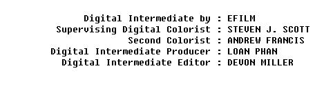

1.	删除子串
【问题描述】编写一个程序，当在一个字符串中出现子串时就删除它。
【输入形式】用户在第一行输入一个字符串，用户在第二行输入一个子串。
【输出形式】程序在下一行输出删除其中所有子串后的字符串。如果字符串不包含子串则输出原字符串本身。
【样例输入】
 I am a boy!
 a            
【样例输出】
 I m  boy!      
【样例说明】用户首先输入字符串I am a boy!,然后输出子串a,程序会寻找字符串中的子串删除它，最后   将删除后的结果输出:I#m##boy!   #表示空格。
【评分标准】结果完全正确得20分，每个测试点4分。提交程序名为：delsubstring.c。

2.	旋转魔方阵(文件)
【问题描述】
输入一个自然数Ｎ（2≤N≤9），要求输出如下的魔方阵，即边长为N*N，元素取值为1至N*N，1在

左上角，呈顺时针方向依次放置各元素。
 N=3时：
    1    2    3
    8    9    4
    7    6    5
【输入形式】
从标准输入读取一个整数N。
【输出形式】
将结果输出到文件文件file.out。输出符合要求的方阵，每个数字占5个字符宽度，向右对齐，在每一行末均输出一个回车符。
【输入样例】
4
【输出样例】输出文件file.out内容为：
        1     2       3     4
     12    13    14     5
     11    16    15     6
     10      9       8     7

【评分标准】
本题不准使用数学库函数。结果正确得20分，每个测试点4分，提交程序文件名为magic.c。

3.	全排列数的生成
【问题描述】输入整数N( 1 <= N <= 10 )，生成从1~N所有整数的全排列。
【输入形式】输入整数N。
【输出形式】输出有N!行，每行都是从1~N所有整数的一个全排列，各整数之间以空格分隔。各行上的全排列不重复。输出各行遵循“小数优先”原则, 在各全排列中，较小的数尽量靠前输出。如果将每行上的输出看成一个数字，则所有输出构成升序数列。具体格式见输出样例。
【样例输入1】1
【样例输出1】1
【样例说明1】输入整数N=1，其全排列只有一种。
【样例输入2】3 
【样例输出2】
1 2 3
1 3 2
2 1 3
2 3 1
3 1 2
3 2 1
【样例说明2】输入整数N=3，要求整数1、2、3的所有全排列, 共有N!=6行。且先输出1开头的所有排列数，再输出2开头的所有排列数，最后输出3开头的所有排列数。在以1开头的所有全排列中同样遵循此原则。
【样例输入3】10
【样例输出3】
1 2 3 4 5 6 7 8 9 10
1 2 3 4 5 6 7 8 10 9
1 2 3 4 5 6 7 9 8 10
1 2 3 4 5 6 7 9 10 8
1 2 3 4 5 6 7 10 8 9
1 2 3 4 5 6 7 10 9 8
1 2 3 4 5 6 8 7 9 10
1 2 3 4 5 6 8 7 10 9
1 2 3 4 5 6 8 9 7 10
1 2 3 4 5 6 8 9 10 7
......................................
【样例说明3】输入整数N=10，要求整数1、2、3、.........、10的所有全排列。上例显示了输出的前10行。
【运行时限】要求每次运行时间限制在20秒之内。超出该时间则认为程序错误。提示：当N增大时，运行时间将急剧增加。在编程时要注意尽量优化算法，提高运行效率。
【评分标准】该题要求输出所有的全排列，提交文件名为full.c。

4.	小数形式与科学计数法转换（简）
【问题描述】

编写一个程序，将用小数表示的浮点数，转换成科学计数法的形式输出。输入的数据没有符号，小数点前后必有数字，且全为有效数据，即小数点后的末尾数字不为0；小数点前若只有一位数字，可以为0，否则小数点前的最高位数字不为0。

提示：以字符串形式保存相关数据。

【输入形式】

从控制台输入一小数，最后有回车换行符，所有输入的字符数不会超过100。

【输出形式】

以科学计数法形式输出数据。输出的数据由以下几部分构成：
1.底数部分是一个小数或整数，若为小数，则小数点前后必有数字，而且都为有效数字。即：小数点前只有一位大于0的数字，小数点后的末尾数字不能为0。若为整数，则只有一位数字，不带小数点。
2.必有小写字母&ldquo;e&rdquo;。
3.指数部分是一个整数，若大于等于0，则不带正号&ldquo;+&rdquo;。若小于0，则需要带负号&ldquo;-&rdquo;，且整数的最高位数字不为0。

【输入样例1】

0.000000000000002

【输出样例1】

2e-15

【输入样例2】

8.9845623489651700659

【输出样例2】

8.9845623489651700659e0

【输入样例3】

367298599999093453490394859509568659795603.4

【输出样例3】

3.672985999990934534903948595095686597956034e41

【样例说明】

以小数形式输入数据，然后转换成科学计数法形式输出。

【评分标准】

该题要求以科学计数法形式输出数据，提交程序文件名为notation.c。

5.	文件排版（非文件）
【问题描述】

英文电影中参演人员名单一般以某种方式进行排版显示。从控制台输入未排版的文件，该文件中每行参演人员名单由冒号“:”分隔成前后两部分，但格式杂乱无章，单词（由除空格和水平制表符之外的其它字符构成）之间可能有多个空格或水平制表符分隔。编写程序，要求将其按如下排版规则排版输出：
1.先从标准输入读取一整数，作为排版后所有各行冒号“:”在一行中的固定位置；假设输入的整数肯定大于排版后所有各行冒号“:”前的字符个数，位置从1开始计数；
2.冒号“:”左边的单词串以冒号为基准右对齐，左边的第一个单词之前如果有多余的位置，则以空格填充；冒号“:”右边的单词串以冒号“:”为基准左对齐，最后一个单词后只有回车换行符，不再有其它字符；
3.冒号“:”左右两边的单词间都只有一个空格分隔，并且要求冒号两边各有一个空格与单词分隔。
假设输入文件中每行字符个数不超过100。

【输入形式】

先从标准输入读入表示冒号“:”位置的整数，然后从下一行开始输入待排版的参演人员名单。输入最后，在新的一行开头输入ctrl+z结束输入。

【输出形式】

排版后的参演人员名单输出到标准输出，最后一行之后要输出一个回车换行符。

【输入样例】

40
   Digital Intermediate by :   EFILM 
Supervising    Digital Colorist : STEVEN J. SCOTT  
 Second Colorist :ANDREW FRANCIS
 Digital Intermediate Producer:LOAN PHAN
Digital  Intermediate Editor:  DEVON MILLER     

【输出样例】

 【样例说明】

输入有五行参演人员名单，要求排版后冒号“:”位于第40个字符的位置，按照上述排版规则输出。

【评分标准】

该题要求按照排版规则对文件内容进行排版，提交程序文件名为typeset.c。

6.	单词排序（命令行参数）
【问题描述】
编写一个程序，从一个文件中读入单词（即：以空格或回车换行分隔的字符串），并对单词进行排序，删除重复出现的单词，然后将结果输出到另一个文件中。
【输入形式】
源文件名和目标文件名在执行时作为程序命令行参数输入，例如若程序名为sort，
源文件名和目标文件名分别为sort.in和sort.out，则命令行为：sort  sort.in  sort.out。
程序将从当前目录下sort.in文件中读入单词。
【输出形式】
对单词进行排序，删除重复出现的单词，然后将结果输出到文件sort.out中。
【输入样例】
假如sort.in文件内容如下：
rrr  sss  aaa  bbb  ccc   ddf  aaa  dd

【输出样例】
sort.out文件内容为：
aaa bbb ccc dd  ddf  rrr sss
【样例说明】
读入文件sort.in，做适当的排序，并删除重复出现的单词，输出到文件sort.out

【评分标准】
对单词进行排序，删除重复出现的单词，符合此要求得20分，每个测试点4分，提交程序名为sortwords.c。